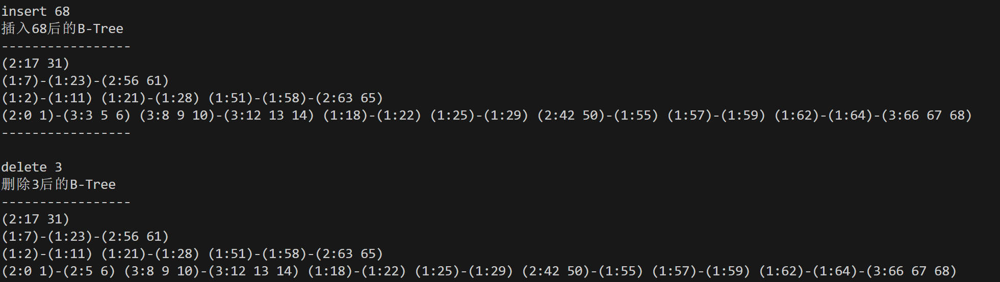

# data-strucures

## intro

南开大学数据结构（24fall），授课老师：辛运帏。

## labs

`./labs` 目录下是实验代码，包括六个实验：

### lab1(List)

根据一篇英文文章，建立索引表。

1. 从文件中读入源数据（单词）。
2. 将各单词保存在数组中。
3. 数组元素中还保存一个指针，指示由该单词在文件中出现的位置组成的线性表。
4. 根据ASCII值对单词进行排序（建索引）。
5. 根据单词出现的频次，建立索引。

### lab2(Huffman codeding&priority queue)

目标：

1. 掌握二叉树的二叉链表存储结构。
2. 掌握Huffman编码及译码过程，并编程实现

要求：

1. 将给定字符文件编码，生成编码，输出每个字符出现的次数和编码；
2. 对给定的文本文件进行编码，将得到的二进制文件与原文本文件进行比较，计算压缩比。
3. 将二进制文件进行译码，还原出的文本文件与原输入文件进行对比。
4. 可以将编码文件与二进制文件捆绑，交换给另一位同学，让其解码，看还原结果。

### lab3(B-tree)

B树的表示及基本操作的实现：

1. 掌握B树的存储结构。
2. 实现B树中关键字值的插入及删除操作。
3. 练习屏幕图形化的显示。

效果图：

### lab4(bfs for "金属融化时间")

求金属融化所需要的时间：

1) 在N × N的格子上放置着形状不规则的金属（5≤N≤1000）。
2) 金属为1×1格子的整数倍组成的不规则形状；
3) 金属有可能中空，这样在开始的时刻中空的方格不会立即充满液体；
4) 当中空的格子有缺口时，液体可以立即进入到中空的地方。
5) T=0时刻从格子的最外围开始注入某种可以融化金属的液体。液体扩散填充的速度不计，例如在T=0时刻液体充满浅蓝色方块。
6) 当金属块上、下、左、右4个方向中至少有两个方向邻接液体的时候，金属块融化，耗时1个时间单位。

### lab5(sorting algorithm for "电路板")

电路板可以使用0/1矩阵表示，0表示不导通态，1表示导通态。
输入：N行×M列的0/1矩阵，及列反转次数K。求经过K次列反转后行全为1的最大行数。其中：3≤N≤100，3≤M≤20，1≤K≤M。必须反转K次，同一列可以多次反转。

例如，输入是下图所示的0/1矩阵，k=3。

输出2，即反转3列，得到最多2行导通。

### lab6(hash table)

用两种不同的哈希构造函数实现HashTable，插入一篇文章的单词，查找另一篇文章中的单词，比较两种方式的平均查找长度。

## experience

基本没听课。

这学期助教要求有点严苛，每次实验都要答辩。
